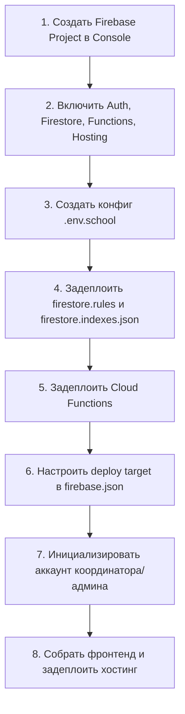

# Инструкция по подключению новой школы к ExtraHub (Multi-Tenant Onboarding)

Данное руководство описывает пошаговый процесс развертывания платформы **ExtraHub** для новой школы-клиента. 

ExtraHub использует архитектуру **Single Codebase + Multi-Project Isolation**:
- Единый исходный код (никаких форков или дублирования репозиториев).
- **100% изоляция данных**: каждая школа имеет собственный независимый проект Firebase (отдельная база Firestore, изолированные пользователи Auth, отдельные Cloud Functions и отдельный Hosting сайт). Это гарантирует строжайшее соблюдение стандартов приватности персональных данных несовершеннолетних.
- Конфигурация интерфейса и брендинга задается через переменные окружения (`VITE_SCHOOL_*`).

---

## Чек-лист шагов подключения



---

## Шаг 1: Создание Firebase-проекта

1. Перейдите в [Google Firebase Console](https://console.firebase.google.com/).
2. Нажмите **Add project** (Добавить проект).
3. Задайте имя проекта, например: `extrahub-<school-alias>` (например `extrahub-miras` или `extrahub-fizmat`).
4. Подключите Google Analytics (по желанию школы) или отключите.
5. Переведите проект на тарифный план **Blaze (Pay as you go)** — это обязательно для работы Cloud Functions Node.js 20+.

---

## Шаг 2: Активация сервисов в Firebase Console

1. **Authentication**:
   - Включите провайдер **Email/Password**.
   - (Опционально) Настройте корпоративный Google OAuth, если школа использует Google Workspace.
2. **Cloud Firestore**:
   - Создайте базу данных в режиме **Production mode**.
   - Выберите регион (рекомендуется `europe-west1` или `asia-east1`).
3. **Cloud Storage**:
   - Активируйте Storage для загрузки школьных аватарок/документов.
4. **Project Settings -> General**:
   - Добавьте Web App (название: `ExtraHub <School Name> Web`).
   - Скопируйте ключи конфигурации `firebaseConfig` (API Key, Project ID, App ID и др.).

---

## Шаг 3: Подготовка конфигурации окружения (.env)

Создайте файл `.env.<school-alias>` (или скопируйте в `.env` при сборке):

```bash
# Firebase Credentials (из Web App Settings новой школы)
VITE_FIREBASE_API_KEY="AIzaSy..."
VITE_FIREBASE_AUTH_DOMAIN="extrahub-<school-alias>.firebaseapp.com"
VITE_FIREBASE_PROJECT_ID="extrahub-<school-alias>"
VITE_FIREBASE_STORAGE_BUCKET="extrahub-<school-alias>.firebasestorage.app"
VITE_FIREBASE_MESSAGING_SENDER_ID="123456789012"
VITE_FIREBASE_APP_ID="1:123456789012:web:abcdef..."

# Школьная идентичность и брендинг
VITE_SCHOOL_NAME="Miras International School"
VITE_SCHOOL_DOMAIN="miras.edu.kz"
VITE_ALLOWED_EMAIL_DOMAIN="miras.edu.kz"

# Логотип школы (поместить файл в /public/schools/<school-alias>-logo.png)
VITE_SCHOOL_LOGO_URL="/schools/miras-logo.png"

# Цвета бренда школы (HEX)
VITE_SCHOOL_PRIMARY_COLOR="#004b87"
VITE_SCHOOL_ACCENT_COLOR="#f39200"

# Конфигурация смен школы (JSON-массив)
# Если у школы 1 смена:
# VITE_SCHOOL_SHIFT_CONFIG='[{"id":1,"name":"1 смена","timeRange":"08:30 - 15:30"}]'
# Если у школы 2 смены:
VITE_SCHOOL_SHIFT_CONFIG='[{"id":1,"name":"1 смена","timeRange":"08:00 - 13:30"},{"id":2,"name":"2 смена","timeRange":"14:00 - 19:30"}]'
```

---

## Шаг 4: Деплой Firestore Security Rules и индексов

Примените правила безопасности и составные индексы к новому проекту:

```bash
# 1. Привязать псевдоним проекта в Firebase CLI
firebase use --add extrahub-<school-alias>

# 2. Деплой правил и индексов базы данных
firebase deploy --only firestore:rules,firestore:indexes --project extrahub-<school-alias>
```

---

## Шаг 5: Деплой серверных Cloud Functions

Cloud Functions содержат критическую транзакционную логику (защита от овербукинга, холд мест 24ч, авто-промоут из листа ожидания).

```bash
# Перейдите в папку functions при необходимости или деплойте из корня:
firebase deploy --only functions --project extrahub-<school-alias>
```

Проверьте в Firebase Console вкладку **Functions**: все функции (`createEnrollment`, `approveEnrollment`, `rejectEnrollment`, `cancelEnrollment`, `registerStudent`, `registerViaInvite` и др.) должны быть в статусе активны (зеленый чекбокс).

---

## Шаг 6: Настройка Hosting Deploy Target

В ExtraHub деплой хостинга для разных школ настраивается через **Firebase Deploy Targets**:

1. Откройте `firebase.json` и добавьте новый таргет в секцию `hosting`:
```json
  "hosting": [
    {
      "target": "pifagor",
      "public": "dist",
      "ignore": ["firebase.json", "**/.*", "**/node_modules/**"],
      "rewrites": [{ "source": "**", "destination": "/index.html" }]
    },
    {
      "target": "miras",
      "public": "dist",
      "ignore": ["firebase.json", "**/.*", "**/node_modules/**"],
      "rewrites": [{ "source": "**", "destination": "/index.html" }]
    }
  ]
```

2. Примените таргет в Firebase CLI:
```bash
firebase target:apply hosting miras extrahub-<school-alias>
```
Команда автоматически обновит `.firebaserc`.

---

## Шаг 7: Первоначальное наполнение (Bootstrap & Seeding)

1. Создайте первого администратора/координатора школы:
```bash
VITE_FIREBASE_PROJECT_ID="extrahub-<school-alias>" node scripts/bootstrap-admin.js
```
2. (Опционально) Импортируйте утвержденный школой каталог кружков и расписание секций:
```bash
VITE_FIREBASE_PROJECT_ID="extrahub-<school-alias>" node scripts/seed-production-data.js
```

---

## Шаг 8: Сборка фронтенда и публикация

Перед сборкой убедитесь, что `.env` содержит переменные для целевой школы:

```bash
# 1. Скопировать конфиг школы в рабочий .env
cp .env.miras .env

# 2. Проверить сборку
npm run build

# 3. Задеплоить собранный фронтенд в Hosting школы
firebase deploy --only hosting:miras --project extrahub-<school-alias>
```

После деплоя откройте выданный URL (например `https://extrahub-miras.web.app`) и выполните вход под созданным координатором.

---

## Чек-лист проверки готовности перед передачей школе

- [ ] В шапке отображается логотип ExtraHub и со-брендинг новой школы.
- [ ] В заголовке вкладки браузера отображается `ExtraHub | <Название Школы>`.
- [ ] В форме регистрации ученика выводятся только разрешенные смены данной школы.
- [ ] Валидация почты принимает только адреса `@<school.domain>`.
- [ ] Тестовая запись в секцию проходит штатно с выделением 24-часового холда.
- [ ] База данных полностью пуста от данных других школ.
